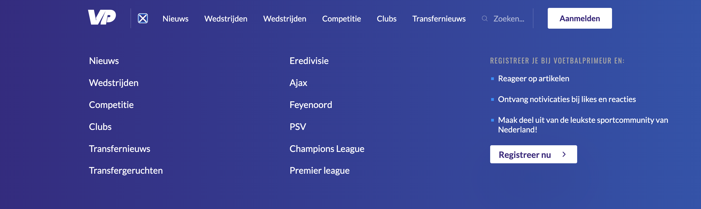
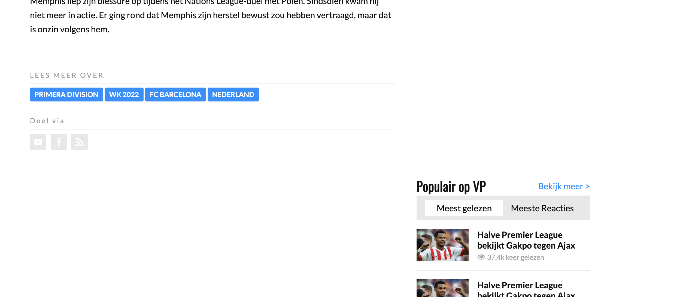

# Procesverslag
Markdown is een simpele manier om HTML te schrijven.  
Markdown cheat cheet: [Hulp bij het schrijven van Markdown](https://github.com/adam-p/markdown-here/wiki/Markdown-Cheatsheet).

Nb. De standaardstructuur en de spartaanse opmaak van de README.md zijn helemaal prima. Het gaat om de inhoud van je procesverslag. Besteedt de tijd voor pracht en praal aan je website.

Nb. Door *open* toe te voegen aan een *details* element kun je deze standaard open zetten. Fijn om dat steeds voor de relevante stuk(ken) te doen.

## Jij

  
uitwerken voor kick-off werkgroep

  ### Auteur:
  Tufan Avci

  #### Je startniveau:
  Rood 

  #### Je focus:
  Mijn focus gaat toch meer naar de responsive laag. Ik ben nu al een jaar werkzaam als UI/UX designer. Tijdens mijn werk krijg ik veel vrijheid en ruimte. In de afgelopen tijd ben ik mijzelf ook een stuk meer gaan verdiepen in het werk als Wordpress Developer. Hierin ben ben je bezig met PhP maar ook zeerzeker met HTML & CSS. In de afgelopen maanden heb ik daarom enorme stappen gemaakt met HTML & CSS. Dit is één van de redenenen waarom ik mijzelf meer in de responsive laag wil verdiepen. Dat gezegd te hebben wil ik uiteraard ook de surface laag zo compleet mogelijk uitwerken. Coderen begin ik steeds beter te begrijpen en begin er ook stiekem van te houden. Dit is ook de rede waarom ik mijzelf als "Rood" classificeer.
 

## Je website

  
uitwerken voor kick-off werkgroep

  ### Je opdracht:
  www.voetbalprimeur.nl

  #### Screenshot(s) van de eerste pagina (small screen): 
  Home
  

  #### Screenshot(s) van de tweede pagina (small screen):
  Pagina nieuws 
  
 

## Toegankelijkheidstest 1/2 (week 1)

  
uitwerken na test in 1e werkgroep

  ### Bevindingen
  De website van Voetbalprimeur scoort goed voor mensen met een beperking betreft het gebruiken van de website. Echter kunnen de links, nav wel een stuk netter,consistenter en uitgebreider beschreven worden.

  #### Screenreader
  Met de screenreader kan je op een goede en logische manier door de links heen navigeren. Persoonlijk vind ik dat de informatie van de links die wordt gegeven een uitgebreider kan. Als je met de screenreader navigeert door de titels mis je op de home pagina een H1 op de pagina. Verder zijn de overige titels wel goed benoemd.
  
  

  #### Muis en Toetsenbord 
  Met de tab button navigeer je op een logische volgorde van item, ook hier mis ik weer een H1.
  Met de pijltjes kan je eenvoudig heen en weer scrollen
  Eenvoudige states. Nav heeft geen verschillende states.

  #### Motoriek (shocks, elastiekjes)
  Het is enorm lastig om met een schokband door de website heen te navigeren. Ik denk echter niet dat dit de schuld is van Voetbalprimeur. Wat wel beter kan zijn de kleine knopjes/tags. Als je dit groter maakt zal het makkelijker te gebruiken zijn voor de motorisch beperkte mensen.

  #### Visueel (brillen, contrast, kleurenblind, dark/light). 
  Kleurenblinden zullen eenvoudig door de website kunnen navigeren. Zowel de verschillende emulations voor "vision deficiences" als de dark mode werken goed.
  Wat wel beter kan is wellicht de states van de buttons. Sommige buttons veranderen van blauw naar paars. Dit kan voor kleurenblinden niet heel goed opvallen, omdat het kleuren zijn die naast elkaar staan in de kleurenwiel
  .
  
    
  
  
    

  

## Breakdownschets (week 1)

  
uitwerken na afloop 2e werkgroep

  ### de hele pagina: 
  
  
  
  

## Voortgang 1 (week 2)

  
uitwerken voor 1e voortgang

  ### Stand van zaken

  Display Flex & Grid zijn dingen waar ik dagelijks mee werk. De opdrachten die hiervoor gedaan moesten worden waren redelijk eenvoudig. Ik ben daarom direct begonnen met het bouwen van mijn website. Ik heb hierbij wat problemen met de header. Vooral bij mijn dropwdown mobile header en styling van mijn button loop ik vast. Dit probeer ik ook beantwoord te hebben tijdens het voortgangsgesprek

  ### Agenda voor meeting
  
  Tijn Neve: Controle van zijn breakdownschets & 2 korte vragen website
  Yente van der Aart: Code inhoudelijk laten checken
  Tufan: Dropdown menu in mijn header
  Robin Langhorst: De breakdown schets en wat over articles in m'n sector van de productpagina

  ### Verslag van meeting
  Mijn vragen voor mijn header zijn beantwoord. Ik had allereerst een mobile navigatiemenu proberen te bouwen met alleen css en veel display nones. Beide zijn semantisch niet correct en daarom ook een no-go. Ik heb uitleg gekregen hoe ik het wel moet doen op de juiste manier. Verder hebben we vooral besproken welk html element je nou specifiek voor dingen moet gebruiken. Ook is er uitgelegd hoe je precies een mobile navigatiemenu moet bouwen of hoe je het best met overflow kunt werken. Dit zijn dingen die ik heb meegenomen.

## Voortgang 2 (week 3)

  
uitwerken voor 2e voortgang

  ### Stand van zaken
  Op het gebied van kennis ben ik mijzelf met de dag steeds meer aan het verbeteren. Ik heb nu alle huiswerkopdracht gedaan tot en met de Javascript opdrachten. De kennis hiervan was tot op zekere hoogte wel al duidelijk bij mezelf. Ik wist hoe je flex,grid,position en basic javascript moest toepassen. Echter wist ik blijkbaar niet hoe je dit op de juiste manier moest toepassen. Zo probeer ik mijzelf nu zo semantisch en net mogelijk code aan te leren. Het spiekbriefje van css volgorde houd ik aan en ik probeer op de juiste manier elementen te selecteren (dus geen onnodige classes bijvoorbeeld). Al deze kennis heb ik gelukkig meegekregen omdat ik het huiswerk volledig heb gemaakt.

  Nu is het de beurt om deze kennis toe te passen voor de code van mijn eigen werk. Ik had in mijn planning om op 6 oktober de website te gaan bouwen. Helaas heb ik dit niet kunnen doen vanwege een hele zieke oma die op haar sterfbed ligt. Op 6 oktober ben ik met de hele famillie naar het ziekenhuis gegaan om afscheid te nemen. Hierdoor heb ik niet de aandacht aan mijn opdracht kunnen geven.

  ### Agenda voor meeting
  samen met je groepje opstellen

  Robin langhorst
  Hoe je een button in de navigatie kan verwerken (hamburger menu en zoekbalk)

  Yente van der Aart
  Inhoudelijke vraag over iets wat niet werkt in haar css

  Tijn Neve
  Wil een video als achtergrond, en header sticky werkt niet.

  Tufan Avci
  vraag over hoe ik z-index het best kan toepassen als ik een element een lagere z-index wil geven dan zijn parent

  ### Verslag van meeting

  We zijn tijdens de meeting iedereen zijn github doorgelopen. Hierin is er gekeken naar de breakdownschetsen en de code van je html en css. Vervolgens zijn er inhoudelijke vragen besproken

  Inhoudelijk moet ik mijn breakdownschets nog gaan aanvullen. Ook moet ik de feedback die ik gekregn heb erin verwerken.

  Daarna heb ik een vraag beantwoord gekregen over grid (grid-auto-flow was het antwoord) en over mijn mobiele dropdown die momenteel over de header loopt terwijl die er onderdoor moet lopen.

## Toegankelijkheidstest 2/2 (week 4)

  
uitwerken na test in 8e werkgroep

  ### Bevindingen
  Op het moment van testen had ik niet heel veel verbeterpunten t.o.v. de website van Voetbalprimeur. Dit komt mede doordat ik nog niet zo heel ver ben met mijn website. Zo heb ik heel veel lege a'tjes. Dit zorgt ervoor dat je screenreader of tabs deze links overslaan. Wel heb ik de links die je op de pagina hebt beter beschreven.

  Op het moment van testen ben ik erachter gekomen dat ik nog een groot deel mis. Dit zal ik gaan aanvullen in mijn uiteindelijke verslag.

  #### Screenreader
  Slaat de h1 kopjes over. Alle h2's worden wel voorgelezen.

  #### Muis en Toetsenbord 
  Menu werkt goed met tab. De content op de website nog niet.
  Als er href wordt toegevoegd zal dit opgelost zijn.

  #### Motoriek (shocks, elastiekjes)
  Met schokband:
  Grote knoppen zijn makkelijk om op te klikken.
  Kleinere knoppen zijn moeilijker te bedienen.

  #### Visueel (brillen, contrast, kleurenblind, dark/light). 
  Kleurenblind bril:
  Omdat er veel afbeeldingen worden getoond op de website is het lastig voor gebruikers die kleurenblind zijn. Het zou kunnen helpen om een filter over afbeeldingen te plaatsen waardoor er meer contrast ontstaat.

  Wazige bril:
  De tekst over een afbeelding is moeilijker te lezen dan eerst. Maar het is nog wel te lezen.

  Kleurenblind modus:
  Wazig filter:
  Tekst is nog redelijk te lezen

  Kleurenblind modus:
  Afbeeldingen komen minder goed naar voren.
  Tekst blijft wel goed leesbaar.

## Voortgang 3 (week 4)

  
uitwerken voor 3e voortgang

  ### Stand van zaken
  Ik loop achter op mijn planning. Dit komt mede doordat ik met spoed naar Turkije ben geweest voor de begrafenis van mijn oma. Dit heeft mede ervoor gezorgd dat ik het enorm druk kreeg met werk. Dus het verwaarlozen van mijn opdracht ging een stuk makkelijker dan het verwaarlozen van mijn werk. Desondanks weet ik wat ik moet doen. Ik verwacht daarbij ook niet dat ik enorm veel problemen zal tegenkomen.

  ### Agenda voor meeting
  
  Yente van der Aart: Ik wil bespreken hoe ik twee elementen kan veranderen door 1 actie uit te voeren in js. en het stijlen van een radio button werkt niet bij mij.
  Tijn Neve: Detailpagina breakdown
  Tufan: Inhoudelijk niet heel veel kunnen doen. Dus vooral vragen over de secties die ik nog moet bouwen

  ### Verslag van meeting
  De website van voetbalprimeur is heel erg desktop first gebouwd. Ik weet nu hoe je sommige secties moet tackelen als je het mobile first wil bouwen. Verder heb ik niet heel uitgebreid feedback kunnen krijgen over mijn werk. Dit mede vanwege mijzelf.

## Eindgesprek (week 5)

  
uitwerken voor eindgesprek

  ### Je uitkomst - karakteristiek screenshots:
  
  
  De responsiveness van deze sectie is goed gelukt. Van mobile flex naar desktop grid.

  
  
  

  Visueel ziet dit er goed uit. Echter heb ik hier wel een beetje gecheat

  ### Dit ging goed/Heb ik geleerd: 
  Het bouwen van het skelet (html) ging naar mijn mening goed. Ik heb dit naar mijn gevoel op een semantisch correcte manier verwerkt.
  De CSS is vrijwel alle keren ook wel gelukt. Mijn kennis over de velen elementen van html en css is gewoon een stuk beter geworden. 
  Vooral op een semantisch correcte manier van werken heb ik geleerd. Dus weet wanneer je gebruik maakt van classes of wanneer er een uitzondering gemaakt mag worden voor div's. Daarbij werken met meerdere css files is ook iets wat ik heb toegepast. Dit kan je allemaal terugzien in mijn code.

  Hoewel ik best wel trots ben op mezelf met mijn eindproduct ben ik er toch niet helemaal tevreden over. Ik heb enorm veel tijd gestopt in de delen die mij niet zijn gelukt. Vervolgens heb ik dit zelf proberen op te lossen. Dit is mij helaas niet helemaal gelukt. Vaak heb ik hierdoor op een andere manier het probleem proberen op te lossen. Een voorbeeld hiervan is de responsive header.
  
  
  
  Ik weet dat ik op een manier gecheat heb dat eigenlijk niet mocht. Ik had dit probleem denk ik helemaal kunnen oplossen met display none erbij. Maar wetend dat dit een no-go is heb ik dit vermeden. Het probleem nu is echter de navigatie met de tabs of screenreader.

  Ik denk dat het probleem echter op te lossen is met javascript. Echter ben ik mijzelf gewoon helemaal kwijt geraakt met Javascript. Hoevaak ik het ook probeerde. Het lukte mijzelf niet en voor mijn gevoel maakte ik het alleen maar erger.

  Tot slot denk ik wel dat mijn product zeerzeker een voldoende waard is. Ik denk dat ik veel code heb geschreven dat past bij piste rood. Dit is waar ik voor mikte en dit is denk ik ook wat mij is gelukt. Ik ben namelijk ook van mening dat mijn website een stuk complexer is dan veel websites van mijn klasgenoten.

  ### Dit was lastig/Is niet gelukt:
  De javascript. Ik vind dit nog steeds enorm lastig om te gebruiken. Ondertussen heb ik een beetje kennis over PhP. Naar mijn mening is dit een stuk makkelijker en begrijpelijker.

   
  Het is mijzelf niet gelukt om dit op te lossen. Ik heb grid auto flow gebruikt en de masonry grid style. 

   
  Hoewel het met de css en html wel goed gelult is ben ik er niet uitgekomen met de javascript. Ik weet dat ik iets niet goed uitvoer maak ik kom er maar niet achter. Ik heb oprecht meerdere keren dit geprobeerd op te lossen en veel uur erin gestoken, maar het is mijzelf helaas niet gelukt

  

## Bronnenlijst

  Nb. Wees specifiek ('css-tricks' als bron is bijv. niet specifiek genoeg).

  1. https://codepen.io/shooft/pen/dymRMBZ - hamburger icon
  2. https://css-tricks.com/video-screencasts/150-hey-designers-know-one-thing-javascript-recommend/ - Javascript voor toevoegen class
  3. https://codepen.io/Wendy-Ho/pen/MWWBvmd?editors=1100 - Tabs met checkboxes voor inloggen/aanmelden sectie & video's
  4. https://git.blivesta.com/flexicon/# - SVG icons
  5. https://www.Voetbalprimeur.nl - content 

  Verder wat ik toegepast heb is vooral de kennis van het huiswerk. Echter is dit code die ikzelf heb geschreven.

