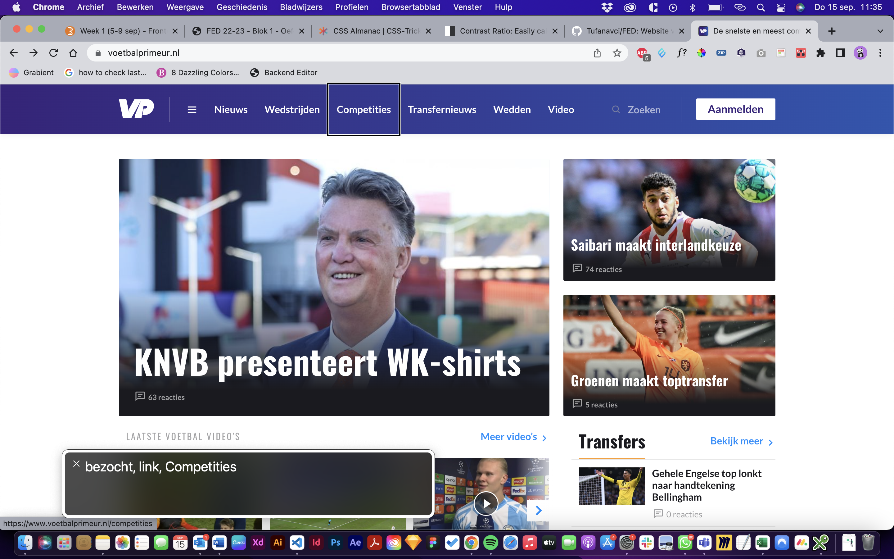

# Procesverslag
Markdown is een simpele manier om HTML te schrijven.  
Markdown cheat cheet: [Hulp bij het schrijven van Markdown](https://github.com/adam-p/markdown-here/wiki/Markdown-Cheatsheet).

Nb. De standaardstructuur en de spartaanse opmaak van de README.md zijn helemaal prima. Het gaat om de inhoud van je procesverslag. Besteedt de tijd voor pracht en praal aan je website.

Nb. Door *open* toe te voegen aan een *details* element kun je deze standaard open zetten. Fijn om dat steeds voor de relevante stuk(ken) te doen.

## Jij

  
uitwerken voor kick-off werkgroep

  ### Auteur:
  Tufan Avci

  #### Je startniveau:
  Rood 

  #### Je focus:
  Mijn focus gaat toch meer naar de responsive laag. Ik ben nu al een jaar werkzaam als UI/UX designer. Tijdens mijn werk krijg ik veel vrijheid en ruimte. In de afgelopen tijd ben ik mijzelf ook een stuk meer gaan verdiepen in het werk als Wordpress Developer. Hierin ben ben je bezig met PhP maar ook zeerzeker met HTML & CSS. In de afgelopen maanden heb ik daarom enorme stappen gemaakt met HTML & CSS. Dit is één van de redenenen waarom ik mijzelf meer in de responsive laag wil verdiepen. Dat gezegd te hebben wil ik uiteraard ook de surface laag zo compleet mogelijk uitwerken. Coderen begin ik steeds beter te begrijpen en begin er ook stiekem van te houden. Dit is ook de rede waarom ik mijzelf als "Rood" classificeer.
 

## Je website

  
uitwerken voor kick-off werkgroep

  ### Je opdracht:
  www.voetbalprimeur.nl

  #### Screenshot(s) van de eerste pagina (small screen): 
  Home
  

  #### Screenshot(s) van de tweede pagina (small screen):
  Pagina nieuws 
  
 

## Toegankelijkheidstest 1/2 (week 1)

  
uitwerken na test in 1e werkgroep

  ### Bevindingen
  De website van Voetbalprimeur scoort goed voor mensen met een beperking betreft het gebruiken van de website. Echter kunnen de links, nav wel een stuk netter,consistenter en uitgebreider beschreven worden.

  #### Screenreader
  Zelf was ik afwezig bij de eerste werkgroep in verband met werk. Ik heb de test uitgevoerd op mijn eigen website.
  Allereerst de screenrecorder. Wat opvalt is dat de navigatiemenu niet wordt benoemd. In de voice over is er geen onderscheid tussen een nav item en een link voor een specifiek artikel. Dit zal dan voor verwarring kunnen zorgen. Door meer informatie te geven kan je het probleem oplossen. Geef uitgebreider aan waar je naar toe navigeert in de link.
  
  

  #### Muis en Toetsenbord 
  Met de tab button navigeer je op een logische volgorde van item.
  Met de pijltjes kan je eenvoudig heen en weer scrollen
  Eenvoudige states. Nav heeft geen verschillende states.

  #### Visueel (brillen, contrast, kleurenblind, dark/light). 
  Kleurenblinden zullen eenvoudig door de website kunnen navigeren. Zowel de verschillende emulations voor "vision deficiences" als de dark mode werken goed.
  
    
  
  
    

  

## Breakdownschets (week 1)

  
uitwerken na afloop 2e werkgroep

  ### de hele pagina: 
  

  ### dynamisch deel (bijv menu): 
  

  ### wellicht nog een dynamisch deel (bijv filter): 
  

## Voortgang 1 (week 2)

  
uitwerken voor 1e voortgang

  ### Stand van zaken
  hier dit ging goed & dit was lastig (neem ook screenshots op van delen van je website en code)

  ### Agenda voor meeting
  samen met je groepje opstellen

  | student 1      | student 2          | student 3    | student 4        |
  | ---            | ---                | ---          | ---              |
  | dit bespreken  | en dit             | en ik dit    | en dan ik dat    |
  | en dat ook nog | dit als er tijd is | nog een punt | dit wil ik zeker |
  | ...            | ...                | ...          | ...              |

  ### Verslag van meeting
  hier na afloop snel de uitkomsten van de meeting vastleggen

  - punt 1
  - punt 2
  - nog een punt
  - ...

## Voortgang 2 (week 3)

  
uitwerken voor 2e voortgang

  ### Stand van zaken
  hier dit ging goed & dit was lastig (neem ook screenshots op van delen van je website en code)

  ### Agenda voor meeting
  samen met je groepje opstellen

  | student 1      | student 2          | student 3    | student 4        |
  | ---            | ---                | ---          | ---              |
  | dit bespreken  | en dit             | en ik dit    | en dan ik dat    |
  | en dat ook nog | dit als er tijd is | nog een punt | dit wil ik zeker |
  | ...            | ...                | ...          | ...              |

  ### Verslag van meeting
  hier na afloop snel de uitkomsten van de meeting vastleggen

  - punt 1
  - punt 2
  - nog een punt
- ...

## Toegankelijkheidstest 2/2 (week 4)

  
uitwerken na test in 8e werkgroep

  ### Bevindingen
  Lijst met je bevindingen die in de test naar voren kwamen (geef ook aan wat er verbeterd is):

  #### Screenreader
  Hier korte omschrijving (met indien nodig afbeeldingen)

  Hier een omschrijving van hoe het opgelost kan worden (met indien nodig afbeeldingen)

  #### Muis en Toetsenbord 
  Hier korte omschrijving (met indien nodig afbeeldingen)

  Hier een omschrijving van hoe het opgelost kan worden (met indien nodig afbeeldingen)

  #### Motoriek (shocks, elastiekjes)
  Hier korte omschrijving (met indien nodig afbeeldingen)

  Hier een omschrijving van hoe het opgelost kan worden (met indien nodig afbeeldingen)

  #### Visueel (brillen, contrast, kleurenblind, dark/light). 
  Hier korte omschrijving (met indien nodig afbeeldingen)

  Hier een omschrijving van hoe het opgelost kan worden (met indien nodig afbeeldingen)

## Voortgang 3 (week 4)

  
uitwerken voor 3e voortgang

  ### Stand van zaken
  hier dit ging goed & dit was lastig (neem ook screenshots op van delen van je website en code)

  ### Agenda voor meeting
  samen met je groepje opstellen

  | student 1      | student 2          | student 3    | student 4        |
  | ---            | ---                | ---          | ---              |
  | dit bespreken  | en dit             | en ik dit    | en dan ik dat    |
  | en dat ook nog | dit als er tijd is | nog een punt | dit wil ik zeker |
  | ...            | ...                | ...          | ...              |

  ### Verslag van meeting
  hier na afloop snel de uitkomsten van de meeting vastleggen

  - punt 1
  - punt 2
  - nog een punt
  - ...

## Eindgesprek (week 5)

  
uitwerken voor eindgesprek

  ### Je uitkomst - karakteristiek screenshots:
  

  ### Dit ging goed/Heb ik geleerd: 
  Korte omschrijving met plaatjes

  

  ### Dit was lastig/Is niet gelukt:
  Korte omschrijving met plaatjes

  

## Bronnenlijst

  
continu bijhouden terwijl je werkt

  Nb. Wees specifiek ('css-tricks' als bron is bijv. niet specifiek genoeg).

  1. bron 1
  2. bron 2
  3. ...

